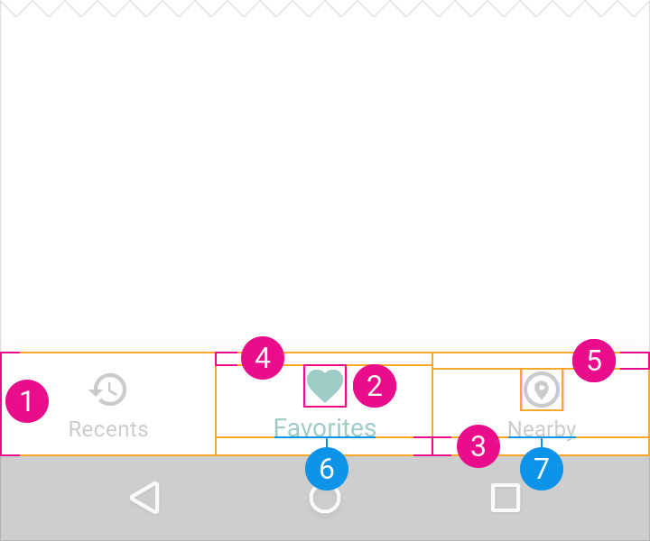
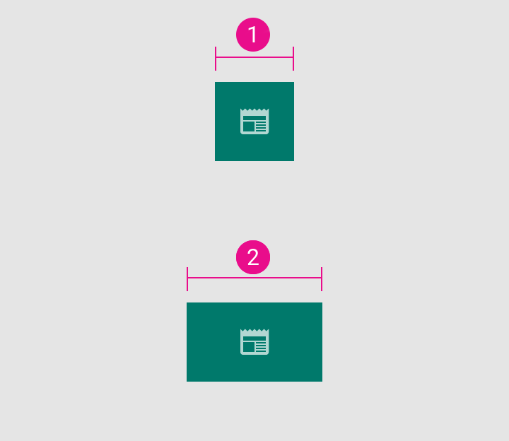
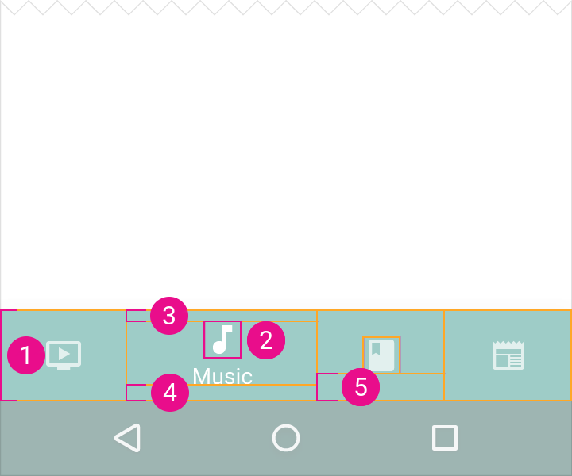

# Bottom navigation

## Elevation

Defined as `@dimen/material_elevation_bottom_nav_bar`.

## Fixed bottom navigation bar

### Action size

1. `@dimen/material_bottom_nav_bar_fixed_action_minimum_width`
2. `@dimen/material_bottom_nav_bar_fixed_action_maximum_width`
3. `@dimen/material_bottom_nav_bar_action_padding_horizontal`

### Bar specs

1. `@dimen/material_bottom_nav_bar_height`
2. `@dimen/material_bottom_nav_bar_action_icon_size`
3. `@dimen/material_bottom_nav_bar_action_label_padding_bottom`
4. `@dimen/material_bottom_nav_bar_fixed_action_active_icon_padding_top`
5. `@dimen/material_bottom_nav_bar_fixed_action_inactive_icon_padding_top`
6. `@dimen/material_bottom_nav_bar_fixed_action_active_label_text_size`
7. `@dimen/material_bottom_nav_bar_fixed_action_inactive_label_text_size`

## Shifting bottom navigation bar

### Action size

1. `@dimen/material_bottom_nav_bar_shifting_action_active_maximum_width`
2. `@dimen/material_bottom_nav_bar_shifting_action_active_minimum_width`

1. `@dimen/material_bottom_nav_bar_shifting_action_inactive_maximum_width`
2. `@dimen/material_bottom_nav_bar_shifting_action_inactive_minimum_width`

### Bar specs

1. `@dimen/material_bottom_nav_bar_height`
2. `@dimen/material_bottom_nav_bar_action_icon_size`
3. `@dimen/material_bottom_nav_bar_shifting_action_active_icon_padding_top`
4. `@dimen/material_bottom_nav_bar_action_label_padding_bottom`
5. `@dimen/material_bottom_nav_bar_shifting_action_inactive_icon_padding_vertical`
6. `@dimen/material_bottom_nav_bar_shifting_action_active_label_text_size`

---

#### See also

- [Raw values](https://github.com/AoDevBlue/MaterialValues/blob/master/material-values/src/main/res-component/values/bottom_navigation.xml)

- [Bottom navigation (Material design)](https://material.google.com/components/bottom-navigation.html)

