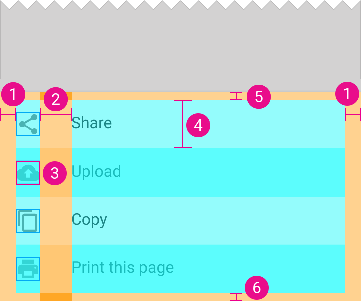
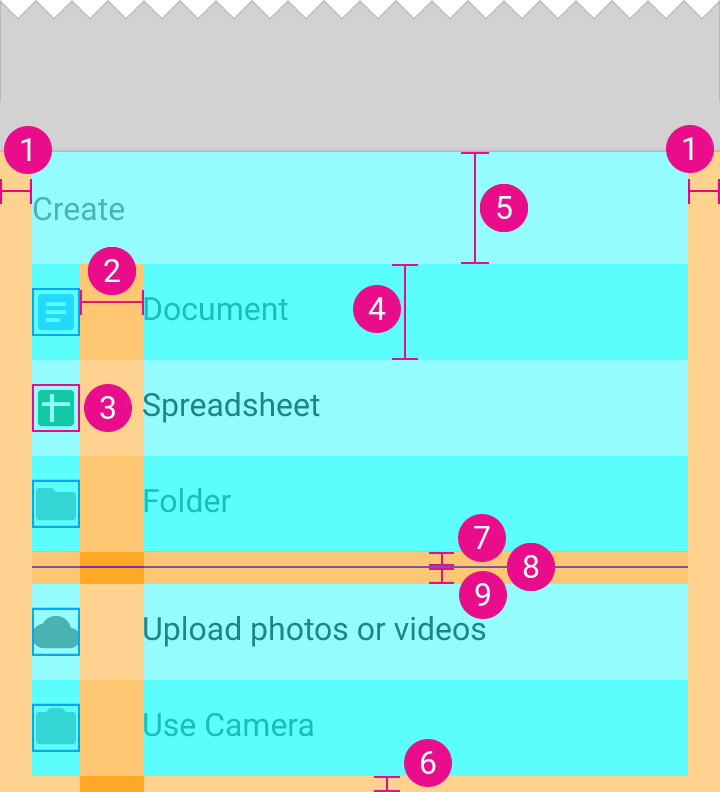

# Bottom sheet

## Font and color

| Name | Resource |
| ---- | -------- |
| Contents text size  | `@dimen/material_bottom_sheet_contents_text_size`  |
| Contents text color | `@color/material_bottom_sheet_contents_text_color` |
| Title text size  | `@dimen/material_bottom_sheet_title_text_size`  |
| Title text color | `@color/material_bottom_sheet_title_text_color` |

| Color | Resource |
| ----- | -------- |
| Sheet background    | `@color/material_bottom_sheet_background_fill` |
| Transparent overlay | `@color/material_bottom_sheet_transparent_overlay_fill` |

## List style

1. `@dimen/material_bottom_sheet_list_padding_horizontal`
2. `@dimen/material_bottom_sheet_list_item_label_padding_start`
3. `@dimen/material_bottom_sheet_list_item_icon_size`
4. `@dimen/material_bottom_sheet_list_item_height`
5. `@dimen/material_bottom_sheet_list_headerless_padding_top`
6. `@dimen/material_bottom_sheet_list_padding_bottom`

1. `@dimen/material_bottom_sheet_list_padding_horizontal`
2. `@dimen/material_bottom_sheet_list_item_label_padding_start`
3. `@dimen/material_bottom_sheet_list_item_icon_size`
4. `@dimen/material_bottom_sheet_list_item_height`
5. `@dimen/material_bottom_sheet_list_header_height`
6. `@dimen/material_bottom_sheet_list_padding_bottom`
7. `@dimen/material_bottom_sheet_list_divider_margin_top`
8. `@dimen/material_divider_height`
9. `@dimen/material_bottom_sheet_list_divider_margin_bottom`

## Grid style

1. `@dimen/material_bottom_sheet_grid_row_padding_top`
2. `@dimen/material_bottom_sheet_grid_item_icon_size`
3. `@dimen/material_bottom_sheet_grid_row_height`
4. `@dimen/material_bottom_sheet_grid_item_label_height`
5. `@dimen/material_bottom_sheet_grid_padding_horizontal`
6. `@dimen/material_bottom_sheet_grid_padding_bottom` 

The text size for labels in a grid style is `@dimen/material_bottom_sheet_grid_item_label_text_size`.

## Elevation

For both styles, the elevation is `@dimen/material_bottom_sheet_elevation`.

## Width (Tablet only)

| Name | Resource |
| ---- | -------- |
| Minimum horizontal margin (increment) | `@integer/material_bottom_sheet_margin_horizontal_minimum_increment` |
| Minimum horizontal margin             | `@dimen/material_bottom_sheet_margin_horizontal_minimum`             |
| Minimum width (increment)             | `@integer/material_bottom_sheet_width_minimum_increment`             |
| Minimum width                         | `@dimen/material_bottom_sheet_width_minimum`                         |

---

#### See also

- [Raw values](https://github.com/AoDevBlue/MaterialValues/blob/master/material-values/src/main/res-component/values/bottom_sheet.xml)

- [Bottom sheets (Material design)](https://material.google.com/components/bottom-sheets.html)

