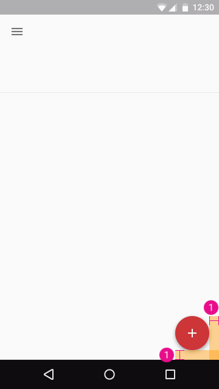

# Buttons: Floating action button

## Size

1. `@dimen/material_button_fab_size`
2. `@dimen/material_button_fab_mini_size`
3. `@dimen/material_button_fab_icon_size`

## Edge margin

1. <del>`@dimen/material_button_fab_edge_margin_horizontal`</del> and <del>`@dimen/material_button_fab_edge_margin_vertical`</del> *Naming issue* 

---

#### See also

- [Raw values](https://github.com/AoDevBlue/MaterialValues/blob/master/material-values/src/main/res-component/values/button.xml)

- [Buttons: FAB (Material design)](https://material.google.com/components/buttons-floating-action-button.html)

