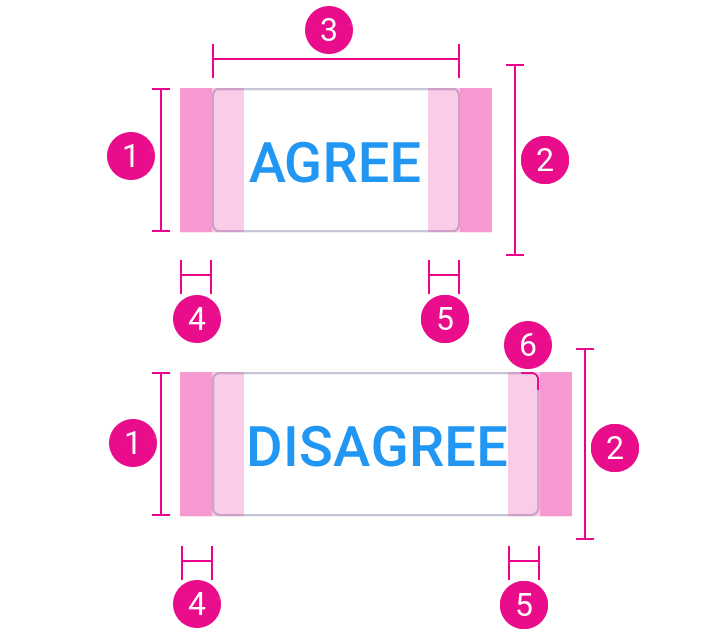
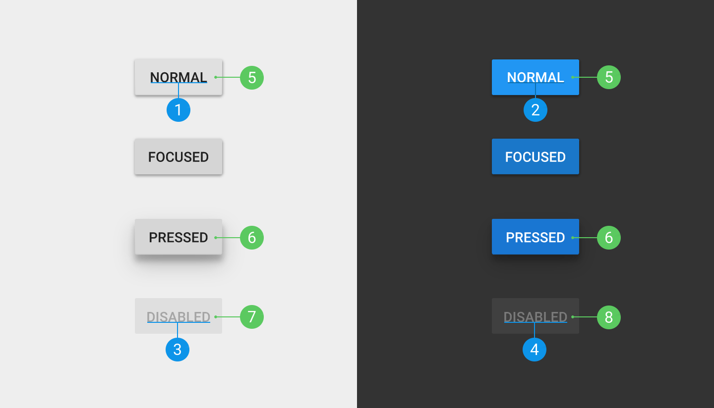
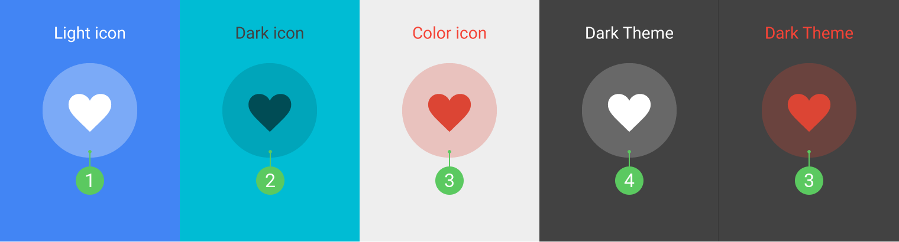

# Buttons

## Size and padding

1. `@dimen/material_button_height_minimum`
2. `@dimen/material_button_touch_target_height_minimum`
3. `@dimen/material_button_width_minimum`
4. `@dimen/material_button_gutter_horizontal`
5. `@dimen/material_button_padding_horizontal`
6. `@dimen/material_button_corner_radius`

## Flat button

### Elevation

Defined as `@dimen/material_button_flat_elevation`

### Font and colors

1. `@dimen/material_typography_regular_button_text_size`, the color depends on the button color (default `@dimen/material_typography_primary_text_color_dark`).
2. `@dimen/material_typography_regular_button_text_size`, the color depends on the button color (default `@dimen/material_typography_primary_text_color_light`).
3. Same text size as 1), `@color/material_button_text_color_disabled_light_theme`
4. Same text size as 1), `@color/material_button_text_color_disabled_dark_theme`
5. `@color/material_button_flat_background_color_pressed_light_theme`
6. `@color/material_button_flat_background_color_pressed_dark_theme`

## Raised button

### Elevation

| Elevation | Resource |
| --------- | -------- |
| Resting | `@dimen/material_button_raised_elevation_resting` |
| Pressed | `@dimen/material_button_raised_elevation_pressed` |

### Font and colors

1. `@dimen/material_typography_regular_button_text_size`, the color depends on the button color (default `@dimen/material_typography_primary_text_color_dark`).
2. `@dimen/material_typography_regular_button_text_size`, the color depends on the button color (default `@dimen/material_typography_primary_text_color_light`).
3. Same text size as 1), `@color/material_button_text_color_disabled_light_theme`
4. Same text size as 1), `@color/material_button_text_color_disabled_dark_theme`
5. Color shade 500
6. Color shade 700
7. `@color/material_button_raised_background_color_disabled_light_theme`
8. `@color/material_button_raised_background_color_disabled_dark_theme`

## Icon toggles

1. `@color/material_button_icon_light_theme_light_icon_ripple_color`
2. `@color/material_button_icon_light_theme_dark_icon_ripple_color`
3. Same color with 26% opacity 
4. `@color/material_button_icon_dark_theme_light_icon_ripple_color`

---

#### See also

- [Raw values](https://github.com/AoDevBlue/MaterialValues/blob/master/material-values/src/main/res-component/values/button.xml)

- [Buttons (Material design)](https://material.google.com/components/buttons.html)

