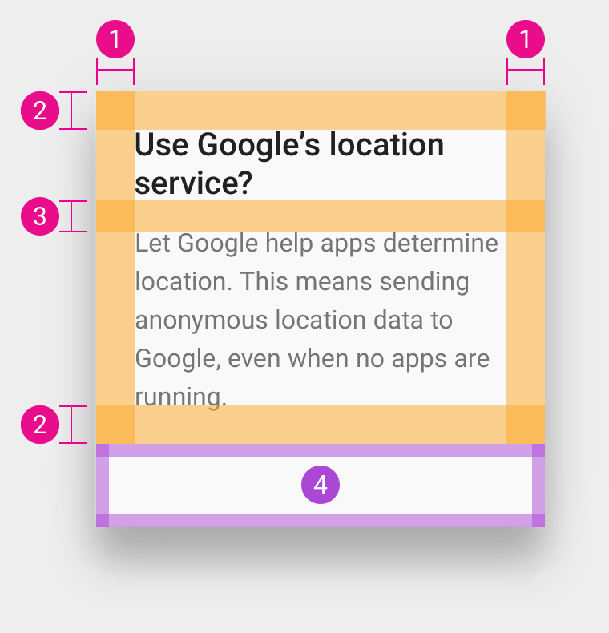
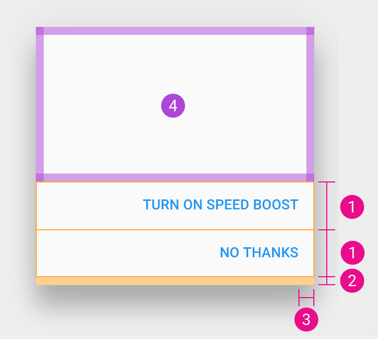

# Dialogs

## Elevation

Defined as `@material_dialog_elevation`.

## Size and edge margins

| Value | Resource |
| ----- | -------- |
| Minimum width (increment)      | `@dimen/material_dialog_width_minimum_increment`               |
| Minimum width                  | `@dimen/material_dialog_width_minimum`                         |
| Minimum vertical edge margin   | `@dimen/material_dialog_screen_edge_margin_minimum_vertical`   |
| Minimum horizontal edge margin | `@dimen/material_dialog_screen_edge_margin_minimum_horizontal` |

## Title and content

1. `@dimen/material_dialog_content_area_padding_horizontal`
2. `@dimen/material_dialog_content_area_padding_vertical`
3. `@dimen/material_dialog_content_area_title_content_margin`
4. Action area

## Actions

### Side by side

1. Non scrollable content
2. Scrollable content
3. `@dimen/material_dialog_actions_side_by_side_height`
4. `@dimen/material_dialog_actions_side_by_side_button_height`
5. <del>`@dimen/material_dialog_actions_side_by_side_padding_horizontal`</del> *Naming issue*
6. <del>`@dimen/material_dialog_actions_side_by_side_padding_vertical`</del> *Naming issue*
7. <del>`@dimen/material_dialog_actions_side_by_side_padding_vertical`</del> *Naming issue* 
8. <del>`@dimen/material_dialog_actions_side_by_side_padding_vertical_with_divider`</del> *Naming issue* 
9. `@dimen/material_divider_height`

### Stacked

1. `@dimen/material_dialog_actions_stacked_button_height`
2. `@dimen/material_dialog_actions_stacked_padding_bottom`
3. `@dimen/material_dialog_actions_stacked_button_padding_end`
4. Dialog content

## Fullscreen dialog

Documentation not yet available, check the raw values.

---

#### See also

- [Raw values](https://github.com/AoDevBlue/MaterialValues/blob/master/material-values/src/main/res-component/values/dialog.xml)

- [Dialogs (Material design)](https://material.google.com/components/dialogs.html)

