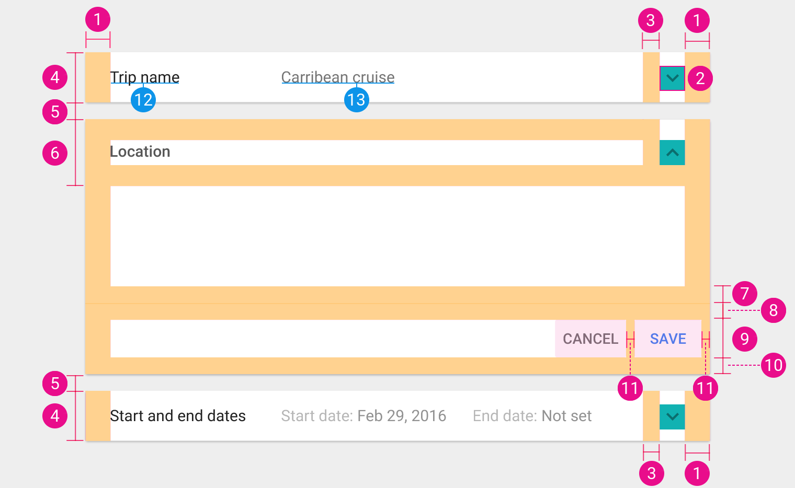

# Expansion panels

## Elevation

The elevation is the same as the elements the expansion panel can connect with (typically, a card).

## Dimensions

1. `@dimen/material_expansion_panel_padding_horizontal`
2. `@dimen/material_expansion_panel_expand_icon_size`
3. `@dimen/material_expansion_panel_expand_icon_margin_start`
4. `@dimen/material_expansion_list_collapsed_height`
5. `@dimen/material_expansion_panel_expanded_margin_vertical`
6. `@dimen/material_expansion_panel_expanded_header_height`
7. `@dimen/material_expansion_panel_expanded_content_area_padding_bottom`
8. `@dimen/material_expansion_panel_expanded_action_area_padding_top`
9. `@dimen/material_expansion_panel_expanded_action_area_button_height`
10. `@dimen/material_expansion_panel_expanded_action_area_padding_bottom`
11. `@dimen/material_expansion_panel_expanded_action_area_button_margin_end`
12. `@dimen/material_expansion_panel_label_text_size` and `@color/material_expansion_panel_label_text_color`
13. `@dimen/material_expansion_panel_label_secondary_content_text_size` and `@color/material_expansion_panel_label_secondary_content_text_color`

Note that action vertical padding (8. & 10.) is splitted because the top padding takes the divider height into account.
It seems that a divider is always present in expansion panels, if it's not the case, use the bottom padding two times.

## Divider

See [Dividers](dividers.md).

---

#### See also

- [Raw values](https://github.com/AoDevBlue/MaterialValues/blob/master/material-values/src/main/res-component/values/expansion_panel.xml)

- [Expansion panels (Material design)](https://material.google.com/components/expansion-panels.html)

