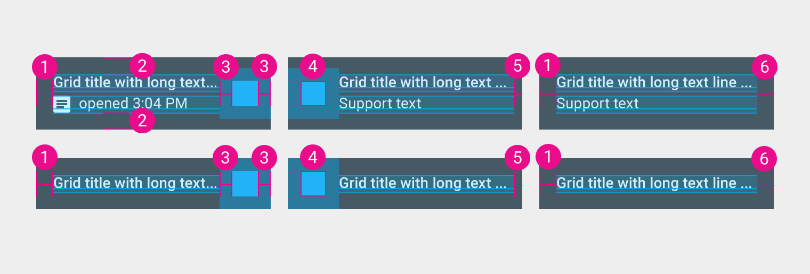

# Grid lists

## Spacing

| Spacing | Resource |
| ------- | -------- |
| Small   | `@dimen/material_grid_list_tile_spacing_small`  |
| Medium  | `@dimen/material_grid_list_tile_spacing_medium` |

## Headers and footers

### Height

| Type | Resource |
| ---- | -------- |
| Single line | `@dimen/material_grid_list_header_footer_single_line_height` |
| Two-line    | `@dimen/material_grid_list_header_footer_two_line_height`    |

### Text size

Two styles exist for headers and footers.

In the material design guidelines, they are referred to as the 16/12 and 14/14 styles.
In the following values, the 16/12 style is called "standard" and the 14/14 "alternative".

| Value | Resource |
| ----- | -------- |
| Title (Standard)       | `@dimen/material_grid_list_header_footer_title_text_size_standard`       |
| Title (Alternative)    | `@dimen/material_grid_list_header_footer_title_text_size_alternative`    |
| Subtitle (Standard)    | `@dimen/material_grid_list_header_footer_subtitle_text_size_standard`    |
| Subtitle (Alternative) | `@dimen/material_grid_list_header_footer_subtitle_text_size_alternative` |

## Dimensions

1. `@dimen/material_grid_list_header_footer_text_area_margin_start`
2. `@dimen/material_grid_list_header_footer_text_area_margin_vertical`
3. `@dimen/material_grid_list_header_footer_icon_padding_horizontal`
4. `@dimen/material_grid_list_header_footer_icon_size`
5. `@dimen/material_grid_list_header_footer_text_area_margin_end_after_icon`
6. `@dimen/material_grid_list_header_footer_text_area_margin_end_alone`

---

#### See also

- [Raw values](https://github.com/AoDevBlue/MaterialValues/blob/master/material-values/src/main/res-component/values/grid_list.xml)

- [Grid lists (Material design)](https://material.google.com/components/grid-lists.html)

