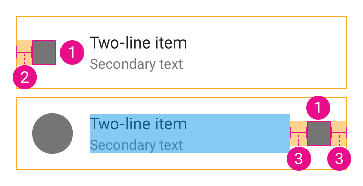

# Lists

The "normal" prefix is added to the guidelines name for non-dense lists values.

## List padding

The padding at the top of the list, before the first element, has the following values.

| Value | Resource |
| ----- | -------- |
| Padding vertical (Normal) | `@dimen/material_list_normal_padding_vertical` |
| Padding vertical (Dense)  | `@dimen/material_list_dense_padding_vertical`  |

## Block position

The values for the text and the icon are based on their relative position in the list item.

| Figure label | List item type | Text position | Icon position |
| ------------ | -------------- | ------------- | ------------- |
| 1 | Text only                 | first & last  | -     |
| 2 | Icon with text            | second & last | first |
| 3 | Avatar with text          | second & last | -     |
| 4 | Avatar with text and icon | second        | last  |

Since the avatar is always first when present, its related values don't depend on its position.

## Icon

1. `@dimen/material_list_icon_size`
2. `@dimen/material_list_icon_first_position_margin_start`
3. `@dimen/material_list_icon_last_position_margin_horizontal`

## Avatar

1. `@dimen/material_list_avatar_size`
2. `@dimen/material_list_avatar_margin_start`

## Text

### Size

| Value  | Resource |
| ------ | -------- |
| Primary text size (Normal)   | `@dimen/material_list_normal_primary_text_size`   |
| Primary text size (Dense)    | `@dimen/material_list_dense_primary_text_size`    |
| Secondary text size (Normal) | `@dimen/material_list_normal_secondary_text_size` |
| Secondary text size (Dense)  | `@dimen/material_list_dense_secondary_text_size`  |

### Margin

1. `@dimen/material_list_text_first_position_margin_start`
2. `@dimen/material_list_text_second_position_edge_margin_start`
3. `@dimen/material_list_text_last_position_margin_end`

1) and 3) can be replaced by `@dimen/material_list_text_only_margin_horizontal` for text only items.

## Item height

| Value | Resource |
| ----- | -------- |
| Single line without avatar (Normal) | `@dimen/material_list_single_line_without_avatar_normal_height` |
| Single line without avatar (Dense)  | `@dimen/material_list_single_line_without_avatar_dense_height`  |
| Single line with avatar (Normal)    | `@dimen/material_list_single_line_with_avatar_normal_height`    |
| Single line with avatar (Dense)     | `@dimen/material_list_single_line_with_avatar_dense_height`     |
| Two-line (Normal)                   | `@dimen/material_list_two_line_normal_height`                   |
| Two-line (Dense)                    | `@dimen/material_list_two_line_dense_height`                    |
| Three-line (Normal)                 | `@dimen/material_list_three_line_normal_height`                 |
| Three-line (Dense)                  | `@dimen/material_list_three_line_dense_height`                  |

---

#### See also

- [Raw values](https://github.com/AoDevBlue/MaterialValues/blob/master/material-values/src/main/res-component/values/list.xml)

- [Lists (Material design)](https://material.google.com/components/lists.html)

