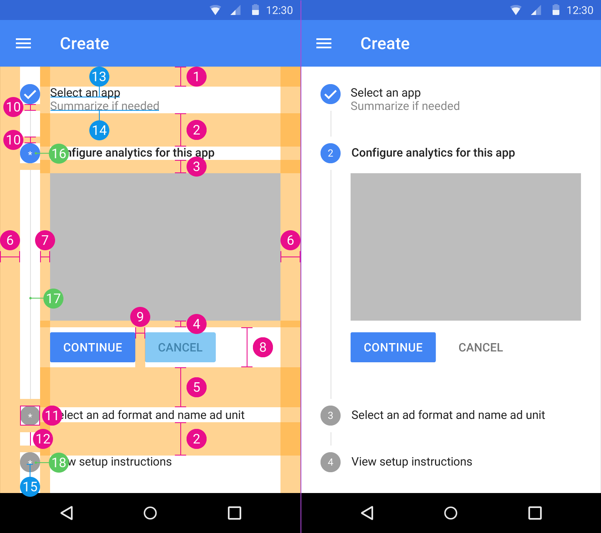

# Steppers

1. `@dimen/material_stepper_padding_top`
2. `@dimen/material_stepper_step_inactive_margin_bottom`
3. `@dimen/material_stepper_step_active_title_margin_bottom`
4. `@dimen/material_stepper_button_area_margin_top`
5. `@dimen/material_stepper_step_active_margin_bottom`
6. `@dimen/material_stepper_padding_horizontal`
7. `@dimen/material_stepper_overview_step_margin`
8. `@dimen/material_stepper_button_area_height`
9. `@dimen/material_stepper_button_gutter`
10. `@dimen/material_stepper_connector_margin`
11. `@dimen/material_stepper_step_circle_size`
12. `@dimen/material_stepper_connector_size`
13. `@dimen/material_stepper_step_title_text_size` and `@color/material_stepper_step_title_text_color`
14. `@dimen/material_stepper_step_subtitle_text_size` and  `@color/material_stepper_step_subtitle_text_color`
15. `@dimen/material_stepper_step_circle_text_size` and `@color/material_stepper_step_circle_text_color`
16. App primary color or `@color/material_stepper_step_active_circle_color_default`
17. `@color/material_stepper_connector_color`
18. `@color/material_stepper_step_inactive_circle_color`

---

#### See also

- [Raw values](https://github.com/AoDevBlue/MaterialValues/blob/master/material-values/src/main/res-component/values/stepper.xml)

- [Steppers (Material design)](https://material.google.com/components/steppers.html)

