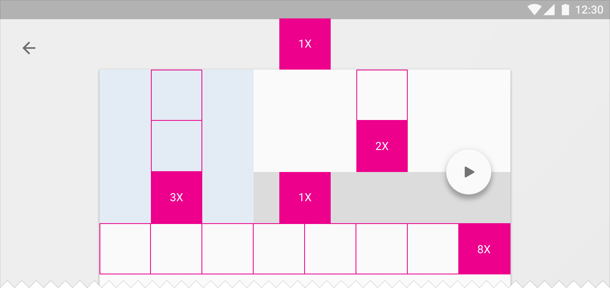

#Metrics & Keylines

## Baseline grid 

Baseline grid values are provided as multiples:

- `@dimen/material_baseline_grid_1x`
- `@dimen/material_baseline_grid_2x`
- ...
- `@dimen/material_baseline_grid_24x`
- `@dimen/material_baseline_grid_25x`

Half-increments are also available for centering elements:

- `@dimen/material_baseline_grid_0.5x`
- `@dimen/material_baseline_grid_1.5x`
- ...
- `@dimen/material_baseline_grid_8.5x`
- `@dimen/material_baseline_grid_9.5x`

It is recommended to use the baseline grid to specify component dimensions.

## Increments

Increment values are provided as multiples:

- `@dimen/material_increment_1x`
- `@dimen/material_increment_2x`
- ...
- `@dimen/material_increment_9x`
- `@dimen/material_increment_10x` 

A default value of 56dp for increments is used to specify increment values.
Every dimension relying on increments is provided alongside an `@integer` value so that a custom increment size can be used.

Half increments are also available for centering elements:

- `@dimen/material_increment_0.5x`
- `@dimen/material_increment_1.5x`
- ...
- `@dimen/material_increment_3.5x`
- `@dimen/material_increment_4.5x`

## Content keylines

1. `@dimen/material_content_edge_margin_horizontal`
2. `@dimen/material_content_secondary_edge_margin_start`

---

#### Related apps

Want to display these keylines on your device?

Use one of the following apps:

**Material Keylines**

- [Google Play](https://play.google.com/store/apps/details?id=blue.aodev.materialkeylines)
- [Github](https://github.com/AoDevBlue/MaterialKeylines)

**Material Cue**

- [Google Play](https://play.google.com/store/apps/details?id=com.actinarium.materialcue)

**Keyline Pushing**

- [Google Play](https://play.google.com/store/apps/details?id=com.faizmalkani.keylines)

---

#### See also

- [Raw values](https://github.com/AoDevBlue/MaterialValues/blob/master/material-values/src/main/res-layout/values/keylines.xml)

- [Metrics & keylines (Material design)](https://material.google.com/layout/metrics-keylines.html)

