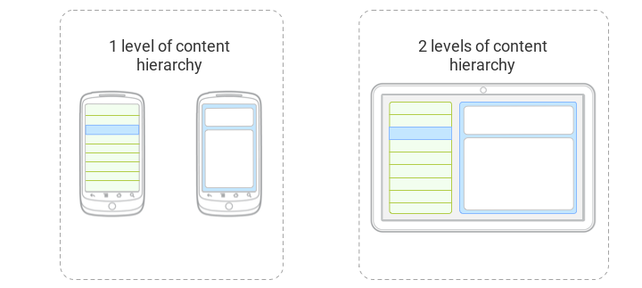

# Responsive UI

## Content hierarchy

The number of content hierarchy levels is defined as `@integer/material_responsive_content_levels`.

## Columns

The number of columns is defined as `@integer/material_responsive_columns`.

## Gutter

The gutter is defined as `@dimen/material_responsive_gutter`.

## Device information

The distinction between handsets and tablets can be made using `@bool/material_responsive_is_tablet`.

**This distinction is arbitrary and might be irrelevant.**

---

#### See also

- [Raw values](https://github.com/AoDevBlue/MaterialValues/blob/master/material-values/src/main/res-layout/values/responsive.xml)

- [Responsive UI (Material design)](https://material.google.com/layout/responsive-ui.html)

