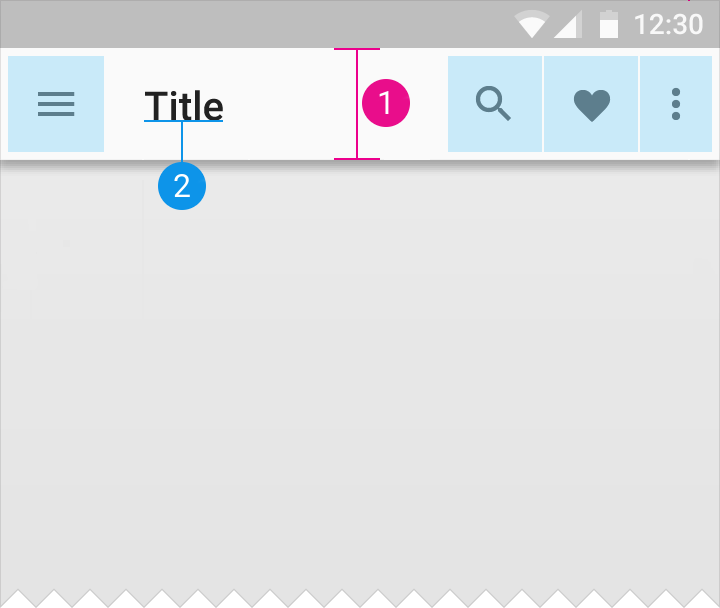

# Structure

## Status bar

| Value | Resource |
| ----- | -------- |
| Height | `@dimen/material_status_bar_height` |

## App bar

### Default

1. `@dimen/material_app_bar_height_default`
2. `@dimen/material_app_bar_default_title_padding_bottom`
3. `@dimen/material_app_bar_title_edge_margin_start`
4. `@dimen/material_app_bar_icon_action_size`
5. `@dimen/material_app_bar_icon_action_icon_size`
6. `@dimen/material_app_bar_icon_action_margin_vertical`
7. `@dimen/material_app_bar_icon_action_margin_horizontal`
8. `@dimen/material_app_bar_default_title_text_size`

### Extended

1. `@dimen/material_app_bar_extended_height`
2. `@dimen/material_app_bar_extended_title_padding_bottom`
3. `@dimen/material_app_bar_extended_title_text_size`

---

#### See also

- [Raw values](https://github.com/AoDevBlue/MaterialValues/blob/master/material-values/src/main/res-layout/values/structure.xml)

- [Buttons (Material design)](https://material.google.com/layout/structure.html)
